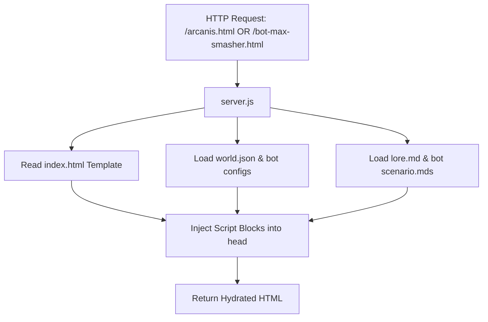

# World Preloading & Hydration Documentation

This document explains the data flow, embedded formats, loader sequence, and AI/crawler compatibility considerations for the World-Nexus data preloading system.

---

## 1. Architecture & Data Flow

The preloading pipeline operates in two modes:

### A. Static Preloads Builder (GitHub Pages / CDN)
When running `npm run build` (or the PowerShell generator), the static generator scans `Worlds/WorldList.json` and compiles world-specific pages (e.g. `arcanis.html`) as well as bot-specific profile pages (e.g. `bot-max-smasher.html`) in the root directory.

```mermaid
graph TD
    A[npm run build] --> B[generate_preloads.js]
    B --> C[Read index.html Template]
    B --> D[Scan World Registries]
    D --> E[Load world.json & character JSONs]
    D --> F[Load raw Markdown files]
    E & F --> G[Format Script Tags]
    C & G --> H[Write world.html and bot-id.html pages]
```



### B. Dynamic SSR Preloading Server (Node.js)
When running the development server (`npm run dev`), request-time injection dynamically intercepts user/crawler requests for specific worlds or bots (e.g. `/arcanis.html`, `/bot-max-smasher.html`, `/bot/max-smasher`, or query params).



---

## 2. Embedded Content Formats

All preloaded metadata and lore are injected into the HTML document's `<head>` within machine-readable script tags.

### World Metadata
Structured world configuration and resolved bot details are stored as JSON in:
```html
<script type="application/json" id="preloaded-world-data">
{
  "worldId": "arcanis",
  "worldConfig": { ... world.json content ... },
  "bots": [ ... bot configs with resolved assets ... ]
}
</script>
```

### Search Engine Optimization (JSON-LD)
Structured semantic metadata about the world is embedded for standard search engines (Google, Bing) and AI crawlers using the Schema.org vocabulary:
```html
<script type="application/ld+json" id="preloaded-world-jsonld">
{
  "@context": "https://schema.org",
  "@type": "CreativeWork",
  "name": "Arcanis",
  "description": "A shattered world...",
  "genre": ["dark-fantasy", "supernatural"],
  "author": {
    "@type": "Person",
    "name": "Odin"
  },
  "character": [
    {
      "@type": "Person",
      "name": "Max Smasher",
      "description": "Anti-hero..."
    }
  ]
}
</script>
```

### Raw Markdown Files
Original Markdown files are embedded exactly without rendering, preserving their formatting and keys:
```html
<script type="text/markdown" id="preloaded-markdown-Worlds-arcanis-lore-md" data-path="Worlds/arcanis/lore.md">
# Arcanis
A shattered world...
</script>
```

---

## 3. Hydration & Startup Sequence

When the page loads:

1. **PreloadRegistry Initialization**: The app synchronously reads the DOM at startup. If `#preloaded-world-data` is found, it initializes the local caches.
2. **Path Routing**: The Router parses the URL. 
   - If the user loaded `/arcanis.html`, it sets the active route to `page: 'world', id: 'arcanis'`.
   - If the user loaded `/bot-max-smasher.html`, it sets the active route to `page: 'bot', id: 'max-smasher'`.
3. **Hydration (No Fetches)**:
   - `WorldService.getWorld("arcanis")` reads directly from the preload registry.
   - `BotService.getBotsForWorld("arcanis")` loads characters from the registry, immediately displaying the grid.
   - `LoreService.loadLore("Worlds/arcanis/lore.md")` fetches the raw markdown content synchronously from the registry, parses it, and renders it.
   - `BotService.getBot("max-smasher")` resolves the bot details from the preloaded dataset, rendering the profile.
4. **Fallback Handling**: If a resource (like a specific character's subpage) was not preloaded, the services dynamically fall back to fetching it via traditional AJAX requests.

---

## 4. AI & Crawler Compatibility Considerations

- **No JS Execution Required**: Crawlers, LLMs, and indexers can fetch the HTML (e.g. `curl https://site/arcanis.html`) and parse the JSON-LD or markdown script blocks directly.
- **RAG Pipeline Friendly**: RAG pipelines can query `<script type="text/markdown">` tags using their `data-path` attributes to match raw source texts with their target references.
- **Exact Format Preservation**: Raw markdown headers (`## Abilities`), list bullets, and key-value metadata are stored exactly to avoid loss of context during search indexing.
