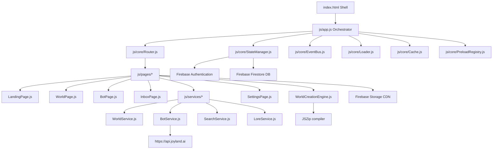
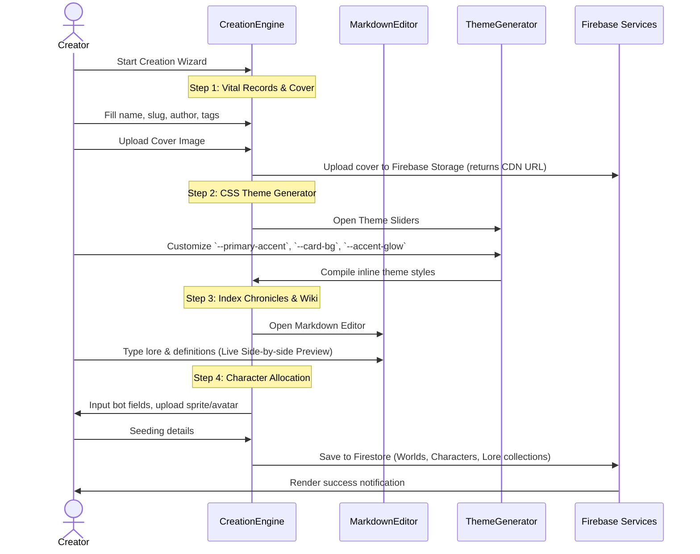

# SOFTWARE REQUIREMENTS SPECIFICATION (SRS)
## Project: World-Nexus (Real-Time World Building & Interactive Entity Explorer)
**Document Version:** 1.1.0  
**Date:** July 1, 2026  
**Author:** Antigravity AI  
**Status:** Approved / Base Specification  

---

## 1. INTRODUCTION

### 1.1 Purpose
This document specifies the software requirements for **World-Nexus**, an interactive web-based platform designed for building, sharing, and collaborating on fictional RPG worlds and intelligent character profiles (bots). The primary goal of World-Nexus is to provide a public, community-driven platform where creators can collaborate in real time, showcase their worlds, and share their creations with a global audience of roleplayers and writers.

### 1.2 Scope
World-Nexus is a collaborative world-building ecosystem and entity hub. The platform runs entirely online, with all user interfaces, articles, and pages served dynamically from cloud hosting. It aggregates fictional universes, compiles custom themes on the fly, integrates with the Joyland AI bot API, and hosts a multi-step World Creation wizard. All newly created worlds, custom character sheets, comments, and co-authoring logs are stored online in the cloud database, enabling real-time global sharing and updates. The core system operates as a fully interactive Single Page Application (SPA).

### 1.3 Design Constraints & Target Environment (Roleplay Intro Tool Only)
The core World-Nexus web platform is a highly interactive application requiring JavaScript for routing, state synchronization, and wizard engines. 

However, a strict design constraint of **progressive enhancement** (HTML/CSS only) applies **exclusively to the Roleplay Intro Tool (Intro Editor)**. This tool generates greeting cards and character cards to be deployed on third-party roleplay hosts (e.g., Joyland greeting messages) where:
* Inline and external JavaScript is completely blocked or sanitized.
* Event handlers (`onclick`, `onload`, etc.) are stripped.
* DOM manipulation is unavailable.
* Layouts must remain visually complete and functional using **only HTML and CSS**.

---

## 2. SYSTEM ARCHITECTURE & DATA FLOW

The application utilizes an Event-Driven Single Page Application pattern. Client-side routing, modular page controllers, and reactive state management are built using vanilla ES modules. All dynamic, collaborative, and social data is synchronized in real time with **Firebase Backend-as-a-Service**.

### 2.1 Component Block Diagram


### 2.2 Data Persistence Architecture
Instead of local browser memory or static local file edits, World-Nexus implements a centralized cloud backend:
* **Firebase Authentication:** Handles user registrations, sign-ins, profile management, and verifies co-authoring collaborator sessions.
* **Firebase Firestore:** A real-time, NoSQL document store housing collections for:
  * `worlds`: Primary metadata, authors, genres, and wiki structures.
  * `characters`: Custom bots, definitions, scenarios, and parent world mappings.
  * `lore`: Full markdown articles and definitions.
  * `comments`: Real-time post feeds with likes and author identifiers.
  * `collaborations`: Editor access invite lists.
  * `inbox`: Real-time review and merge request queues.
* **Firebase Storage:** Stores media assets (world covers, logos, character avatars, sprites, and gallery images) and returns secure CDN URLs.

### 2.3 Offline Layer (PWA)
A Service Worker (`sw.js`) intercepts HTTP requests to enable offline operational capability:
* **Precache Assets:** Initial load scripts (`app.js`, `Router.js`, etc.), main styles (`variables.css`, `base.css`), icons, and config files.
* **Cache-First Strategy:** Applied to Google Fonts origins (`fonts.googleapis.com`, `fonts.gstatic.com`) and CDN scripts (Bootstrap Icons, Firebase SDKs via `cdn.jsdelivr.net`).
* **Stale-While-Revalidate Strategy:** Applied to local page scripts, worlds configuration, and cached Firestore snapshots to enable background updating without blocking the user.

---

## 3. CORE INFRASTRUCTURE SPECIFICATION

### 3.1 Router Module (`js/core/Router.js`)
Handles client-side path parsing, popstate observation, and page transition triggers.
* **Navigation Hooks:** Listens to `popstate` and `hashchange` browser events.
* **Anchor Interception:** Intercepts general clicking of `<a>` tags. Excludes external links, mailto/tel protocols, downloads, and hash-anchors targeted to the active document.
* **Dynamic Resolvers:**
  * **Hash:** Resolves `#/world/<id>`, `#/bot/<id>`, `#/profile/<id>`, `#/settings/<tab>`, `#/feed`, `#/inbox`, and `#/tag/<tag>`.
  * **Query String:** Resolves search links containing `?world=...`, `?bot=...`, `?tag=...`.
  * **Static File Path Fallback:** Matches clean preloaded HTML files (e.g., `/arcanis.html` or `/bot-max-smasher.html`) to facilitate static hosting crawls (SEO indexability).
* **Auto-Resolving Link Helper:** Dynamic markdown links containing class `.auto-resolve-link` query `WorldService` asynchronously on click to classify the destination as a world or a bot page and routes accordingly.

### 3.2 State Manager Module (`js/core/StateManager.js`)
Manages client-side reactivity and real-time backend synchronization.
* **Global State Schema:**
  ```javascript
  this.state = {
    currentWorld: null,      // Active world object
    searchQuery: '',         // Core search keyword
    selectedGenres: [],      // Active category filter tags
    sortBy: 'featured',      // Sort order: featured, newest, alphabetical, popular
    theme: 'dark-theme',     // Global theme tag
    favorites: [],           // Favorited bot IDs
    currentUser: null,       // User profile session object (Guest if null)
    activeIdentity: null,    // User's active posting identity (username or bot ID)
    customCharacters: [],    // Syncs with Firestore 'characters' collection
    customWorlds: [],        // Syncs with Firestore 'worlds' collection
    comments: [],            // Syncs with Firestore 'comments' collection
    follows: [],             // Syncs with Firestore 'follows' collection
    inboxRequests: [],       // Syncs with Firestore 'inbox' review collection
    notifications: [],       // Real-time listener notification log
    worldActivities: [],     // Simulated timeline activities
    worldCollaborators: {},  // Mapping of world IDs to collaborator permissions
    customLore: []           // Syncs with Firestore 'lore' collection
  };
  ```
* **Reactivity:** Emits event updates (`state:<key>`) via `EventBus` when state parameters change.
* **Firebase Synchronization:** Implements active listeners (`onSnapshot`) to automatically push updates from Firebase Firestore into the local state. Saving states executes write commands to Firebase collections rather than writing to local memory.
* **Offline Fallback:** If internet connection is lost, Firestore offline cache enables reads and writes, queueing up writes to sync once the connection is restored.

### 3.3 Event Bus Module (`js/core/EventBus.js`)
A publish-subscribe messaging hub enabling decoupled communication between UI components, core services, and page transition controllers.
* **Methods:**
  * `on(event, callback)`: Registers event listener callbacks.
  * `off(event, callback)`: Unsubscribes active event callbacks.
  * `emit(event, data)`: Synchronously dispatches payloads to active subscriptions.

---

## 4. SERVICE LAYER SPECIFICATION

### 4.1 World Service (`js/services/WorldService.js`)
Orchestrates online world metadata retrieval.
* **Online Database Retrieval (Canonical Source):** Fetches the active list of worlds and their configurations directly from the online cloud database (Firebase Firestore). All new worlds created by the community are written to this database and immediately indexed for public browsing.
* **Legacy/Static Registry Fallback:** For backwards compatibility or offline caching, fallback checks are executed against local static files (`Worlds/WorldList.json` registry and `<world>/world.json` files).
* **Concurrent Metadata Retrieval:** Resolves individual world definitions concurrently:
  * Pulls world configurations from Firestore database documents.
  * Dynamically parses theme variables to extract primary and accent colors from style properties (e.g. `--primary-accent` and `--bg-hero-overlay`) to apply custom colors to the viewport.
* **Preload Integration:** Intercepts load pipelines to pull pre-compiled worlds from `PreloadRegistry` first, optimizing initialization speeds.

### 4.2 Bot Service (`js/services/BotService.js`)
Orchestrates character profiles and API integration.
* **API Synchronization:** Interfaces with the Joyland API endpoint:
  `https://api.joyland.ai/profile/public-bots?userId=<userId>`
  * Triggers concurrent GET requests for configured creator IDs (e.g., `2xYazJ`, `lMjZp`, `rd2be`).
  * Injects custom request headers: `Origin`, `Referer`, and a client-side generated alphanumeric `Fingerprint`.
* **Dynamic Stats Extraction:** The following fields are extracted from the Joyland API response payloads:
  * `botId`: Handled as the remote bot identifier.
  * `characterName` or `name`: The display name of the bot.
  * `avatar`: Profile image resource URL.
  * `introduce` or `introduceText`: Character description/summary.
  * `botChats` or `chatCount`: Chat interaction total count.
  * `botLikes` or `likeCount`: Total recommendation likes count.
  * `tags`: Array of categories (including gender tags like "Male", "Female", "Non-binary").
  * `categoryName`: Sub-genre/category classification.
* **Dynamic Stats Merging:** Maps dynamic Joyland statistics back to local characters:
  * Extracts target bot IDs by parsing `chatEndpoint` with regex matching `/chat/([a-zA-Z0-9]+)`.
  * Merges the dynamic stats (`chats`, `likes`, `tags`) into the corresponding local character profile.
  * Combines tags cleanly: `bot.tags = Array.from(new Set([...localTags, ...joyTags]))`, and mirrors this to `bot.genres`.
  * Syncs local attributes back to the Joyland bot object (`id`, `worldId`, `worldTitle`, `worldAccent`, `worldAccentRgb`, `hasLocalData = true`, `lore`) to allow the platform to theme dynamically fetched remote characters correctly.
  * Emits `bots:synced` event to trigger dynamic UI updates.
* **Custom Character Composition:** Resolves and combines pre-compiled world characters, dynamic Joyland characters, and locally stored custom characters into a unified dataset.

### 4.3 Search Service (`js/services/SearchService.js`)
Features advanced structured prefix queries and background content indexing.
* **Search Query Parsing:** Translates text queries into categorized structural filters. Supports prefix tags and phrase values wrapped in quotes:
  * `tag:<genre>` or `tags:<genre>`
  * `character:<name>` or `characters:<name>`
  * `bot:<name>` or `bots:<name>`
  * `creator:<author>` or `creators:<author>`
  * `author:<author>` or `authors:<author>`
* **Query Parser Pattern:**
  ```javascript
  // Example query: 'tag:"dark fantasy" character:max'
  // Result:
  {
    tags: ["dark fantasy"],
    characters: ["max"],
    bots: [],
    creators: [],
    general: []
  }
  ```
* **Asynchronous Global Indexing:** Initialized on bootstrap. Iterates through all worlds and characters to pre-fetch text datasets in the background:
  * Downloads main world `lore.md` files.
  * Resolves `library.json` wikis and fetches subpage markdown documents.
  * Downloads character `lore.md` and `scenario.md` files.
  * Consolidates terms into `searchIndexContent` arrays mapped to the cache, enabling instantaneous multi-field client-side searches.

---

## 5. UI COMPONENTS & INTERACTION SPECIFICATION

### 5.1 Hover Preview Card (`js/ui/HoverPreview.js`)
Implements non-intrusive metadata preview windows.
* **Hover Interaction:** Observes elements containing `.hover-preview-trigger`. On hover, positions a floating dynamic overlay relative to the viewport.
* **Image Sequencing:** Displays a sequence of hover images (defined as `hoverImages` in `world.json`) transitioning through an animation loop.

### 5.2 Theme Loader Component (`js/ui/ThemeLoader.js`)
Adapts the application styling shell to the aesthetic rules of a specific world.
* **Injected Styling:** Injects an `<link>` stylesheet target referencing the world's `style.css`.
* **Cleanup Strategy:** Clears injected style links on page unloads, restoring the default World-Nexus theme variables.

### 5.3 Comment System (`js/ui/CommentSystem.js`)
Facilitates social interactions attached to worlds or character boards.
* **Posting Identity Switcher:** Users can post comment entries under their profile user handle, or masquerade as any bot belonging to the current world (if local files provide corresponding sprites).
* **Likes System:** Increments localized like counts. Persists changes back to the state log.
* **Mention System:** Parses comments for `@character-id` triggers. Wraps mentions in dynamic links with the class `mention-link` to enable navigation to that character profile.

### 5.4 Character Cards Component (`js/ui/BotCard.js`)
Renders fully interactive, responsive portrait-aspect card modules for character entities within worlds or search views.
* **Dynamic Variable Binding:** Card elements are populated using the following properties:
  * `bot.name` / `bot.title` (falls back to "Unknown Bot"): Populates the card header title.
  * `bot.cardImage` / `bot.avatar`: Binds to the background portrait layout utilizing `lazyLoader`.
  * `bot.chats` (falls back to `0`): Populates the chat interaction stat chip.
  * `bot.likes` (falls back to `0`): Populates the recommendation likes stat chip.
  * `bot.description` / `bot.introduce` (falls back to "No description available."): Populates the description snippet.
  * `bot.genres` / `bot.tags`: Rendered as clickable genre tags at the bottom.
  * `bot.chatEndpoint`: Binds to the "Start Chat" CTA button (triggered on card hover).
* **Dynamic World Theme Injection:** The card layout container dynamically injects the parent world's style specifications:
  * Maps `bot.worldAccent` to `--accent` CSS variable.
  * Maps `bot.worldAccentRgb` to `--accent-rgb` CSS variable.
  * Binds variables to styling declarations to automatically adjust glows, border accents, and card button hover states to match the character's parent world theme.
* **Special Type Handling:** Detects if a card is "Joyland Only" (`!bot.worldId` and references a `joyland.ai` endpoint). Clicking the card automatically triggers direct external redirection instead of loading internal bot details subpages.

---

## 6. FUNCTIONAL WORKFLOWS & WIZARDS

### 6.1 Unified Creation Engine (`js/pages/WorldCreationEngine.js`)
An interactive multiphase dashboard enabling real-time authoring of worlds, character profiles, and lore records.



#### 6.1.1 Step-by-Step Creation Phase Details
* **Step 1: Vital Records & Cover:** Captures world name, author, categories, and folder slug ID (slug validates against folder characters to avoid naming conflicts). Users upload a cover image via the file upload zone.
* **Step 2: CSS Theme Generator:** Features interactive color pickers, opacity sliders, and font option dropdowns. It dynamically modifies the live preview canvas styling variables (`--primary-accent`, `--bg-hero-overlay`, `--text-gold`, `--card-bg`, `--accent-glow`) in real time, compiling them into a clean CSS configuration string.
* **Step 3: Index Chronicles & Wiki:** Houses a dual-pane, real-time Markdown editor with live preview compilation (parsed through `marked.js` and purified via the security wrapper). Enables adding terms directly to the world's Wiki catalog (`library.json` map).
* **Step 4: Character Allocation:** Seeding custom bots with details (ID, name, description, avatar, and sprite) that immediately populate the world's character list.
* **Database Serialization:** On completion, the wizard writes documents directly to Firestore:
  * Creates a world document in `worlds` collection.
  * Creates associated lore articles in `lore` collection.
  * Creates seeded bots in `characters` collection.
  * Offers an export package using JSZip as a local backup download.

#### 6.1.2 Detailed Markdown Editor & Notion-Style Authoring Spec
To deliver an intuitive lore-crafting experience, the creation platform features a WYSIWYG-Markdown hybrid editor replicating Notion-like functionality:
* **Interactive Slash Commands (`/`):** Typing `/` on a blank line opens a floating contextual block-insertion overlay. Creators navigate via keys or cursor to select:
  * `/h1`, `/h2`, `/h3`: Dynamic heading formats.
  * `/bullet`, `/numbered`: Bulleted or ordered lists.
  * `/todo`: Interactive checklists that render toggles.
  * `/callout`: Emoji-iconified highlighted callout box with custom accent fills.
  * `/quote`: Styled left-border blockquote containers.
  * `/spoiler`: RPG spoiler containers (`||spoiler content||`).
  * `/code`: Syntactical code editor boxes.
  * `/toggle`: Collapsible text sections for layered details.
* **Contextual Selection Bubble Toolbar:** Highlighting text triggers a floating, touch-friendly formatting popup for rapid alterations:
  * **Controls:** Bold (`**`), Italic (`*`), Strikethrough (`~~`), Underline (`<u>`), Code (```), Link linking (`[text](url)`), and dynamic Text Color highlights.
* **Auto-Conversion Markdown Shortcuts:** Converts markdown syntax prefixes to live HTML structures instantly on key spacepress:
  * Typing `# ` turns the block into an H1.
  * Typing `> ` turns the block into a Callout/Quote.
  * Typing `- [ ] ` turns the block into an active checklist item.
* **Real-time Split-Screen & Sync Syncing:** Provides a side-by-side workspace displaying a raw text editor on the left and a reactive, purified HTML canvas rendering live styling previews on the right.
* **Dynamic Backlinks & Mentions Suggestions:**
  * **Character Mentions (@):** Typing `@` pops up a dropdown autocomplete listing bots registered in the world, inserting link tags on selection.
  * **Wiki Backlinks ([[):** Typing `[[` initiates a local term dictionary lookup from the database, auto-suggesting term subpages to link to and automatically establishing references/cross-links in Firestore.
* **HTML Purification:** Cleans rendered tags on the fly via a security filter module to prevent XSS.

#### 6.1.3 CSS Theme Generator Specifications
* **Interactive Controls:** Visual swatches and sliders mapping directly to root design variables.
* **Variables Scoped:**
  * `--primary-accent`: Base highlight color.
  * `--accent-glow`: Box-shadow neon glow spread intensity.
  * `--card-bg`: Background opacity of component panels.
  * `--bg-hero-overlay`: Background linear overlay tone.
* **Dynamic Viewport Compilation:** Compiles the configured variable list into a stylesheet text block, saving it inside the world's database document and dynamically injecting it when users explore the world.

### 6.2 Collaborative Sharing & Social Features
Provides complete community mechanics for co-authoring and social interaction.
* **Role-Based Collaborations:** World owners manage access lists via Firestore permissions:
  * **Owner:** Full edit rights, collaborator invitations, world deletions.
  * **Admin:** Moderate comments, accept community lore submissions, edit configurations.
  * **Editor:** Edit lore subpages, add wiki definitions, update character settings.
  * **Contributor:** Create lore drafts and character proposals for review.
* **Collaboration Invites & Merging (PRs):** Users can invite other creators to collaborate. Invitees receive alerts in their **Inbox Control Panel** (`js/pages/InboxPage.js`). Contributors can submit lore drafts and bot configs which queue as actionable proposals inside the world owner's inbox, enabling comparison diff reviews and one-click database merges.
* **Social Systems:**
  * **Comment Feeds:** Real-time post lists updated via Firestore listener threads. Supports replying to comments.
  * **Identity Masking:** Users can choose to comment as their default profile name or post comments disguised as any character/bot belonging to the active world.
  * **Likes & Follows:** Real-time metrics counting likes on bot cards, lore articles, and world reviews, alongside following worlds to push updates directly into the feed.
  * **Real-time Notifications:** Dispatches toast alerts and increments inbox badges when comments are liked, replies are posted, or collaborator access is modified.

### 6.3 Centralized Image Upload Service
Provides secure, processed media uploads to the cloud.
* **Drag-and-Drop Uploader:** Supports drags, file dialogs, and copy-paste uploads.
* **Client-Side Processing:** Validates files (e.g., max size 5MB, format restriction to SVG, PNG, JPG, WebP, AVIF) and performs client-side compression/scaling where necessary.
* **Firebase Storage Integration:** Uploads the binary files to specific directories (e.g., `/worlds/covers/`, `/characters/avatars/`), retrieves a public CDN token link, and writes the URL back to the associated document properties in Firestore.

---

## 7. EXTERNAL & AUXILIARY TOOLS (NON-CORE COMPONENTS)

These are auxiliary, external tools that do not form a major part of the core World-Nexus collaborative platform, serving as separate utilities for creators.

### 7.1 Roleplay Intro Tool / Intro Editor (`tools/intro-editor/ie.html`)
An external visual card layout builder that generates clean HTML/CSS components for third-party platforms (like Joyland greeting messages).
* **No-JS Compatibility:** Generates layouts that function without script execution, adhering to strict progressive enhancement rules for external environments.
* **Features:**
  * Preset theme select inputs (Cyberpunk, Steampunk, Outrun, Solarpunk).
  * Variable color swatches mapping directly to output styling selectors.
  * Clean, inline markup and compressed stylesheet builder.

### 7.2 Music Player (`tools/music-player/mw.html`)
An external tactical theme widget featuring video/audio synchronization.
* **Hidden Media Frame:** Controls playback of streaming clips via a hidden `<iframe>` acting as the audio player engine.
* **Layout Design:** Styled after sci-fi control panels (Nasapunk aesthetics), incorporating background grids, visualizers, track list selection drawers, and progress bars.

---

## 8. NON-FUNCTIONAL REQUIREMENTS

### 8.1 Performance & Resource SLAs
* **FOIT Prevention:** Preloads critical typography subsets (`Cinzel`, `Outfit`, `Orbitron`, `Rajdhani`) alongside display swap declarations.
* **Non-Blocking Assets:** Scripts and stylesheets for third-party libraries (e.g., JSZip, Bootstrap Icons) must load asynchronously using defer attributes or print media tricks.
* **Lazy Loading:** Main scroll lists (grids) must defer rendering and asset loading for below-the-fold content using the `IntersectionObserver` wrapper (`LazyLoader.js`).

### 8.2 Security & Purification
* **HTML Sanitization:** To counter injection vulnerability in markdown lore parsers, `LoreService.purifyHtml()` must strip standard script elements, script tags, event variables, and javascript/data URI protocol strings from input markdown before passing content to `marked.js`.
* **Link Target Hardening:** All external hyperlinks must declare `target="_blank" rel="noopener noreferrer"`.

---

## 9. APPENDIX: METADATA & DATA SCHEMAS

### 9.1 World Schema (`world.json`)
```json
{
  "$schema": "http://json-schema.org/draft-07/schema#",
  "type": "object",
  "properties": {
    "id": { "type": "string" },
    "title": { "type": "string" },
    "author": { "type": "string" },
    "colaborators": {
      "type": "array",
      "items": { "type": "string" }
    },
    "description": { "type": "string" },
    "genres": {
      "type": "array",
      "items": { "type": "string" }
    },
    "coverImage": { "type": "string" },
    "logo": { "type": "string" },
    "theme": { "type": "string" },
    "lore": { "type": "string" },
    "botCount": { "type": "integer" },
    "hoverPreview": { "type": "boolean" },
    "hoverImages": {
      "type": "array",
      "items": { "type": "string" }
    },
    "featuredBots": {
      "type": "array",
      "items": { "type": "string" }
    }
  },
  "required": ["id", "title", "description"]
}
```

### 9.2 Wiki Term Library Schema (`library.json`)
```json
{
  "$schema": "http://json-schema.org/draft-07/schema#",
  "type": "object",
  "additionalProperties": {
    "type": "object",
    "properties": {
      "definition": { "type": "string" },
      "subpage": { "type": "string" }
    },
    "required": ["definition"]
  }
}
```

### 9.3 Character / Bot Schema (`<character-id>.json`)
```json
{
  "$schema": "http://json-schema.org/draft-07/schema#",
  "type": "object",
  "properties": {
    "id": { "type": "string" },
    "name": { "type": "string" },
    "world": { "type": "string" },
    "description": { "type": "string" },
    "genres": {
      "type": "array",
      "items": { "type": "string" }
    },
    "cardImage": { "type": "string" },
    "avatar": { "type": "string" },
    "sprite": { "type": "string" },
    "lore": { "type": "string" },
    "scenario": { "type": "string" },
    "chatEndpoint": { "type": "string" },
    "status": { "type": "string" },
    "featured": { "type": "boolean" },
    "metadata": {
      "type": "object",
      "properties": {
        "character": { "type": "string" },
        "timeline": { "type": "string" }
      }
    }
  },
  "required": ["id", "name", "world", "description"]
}
```
