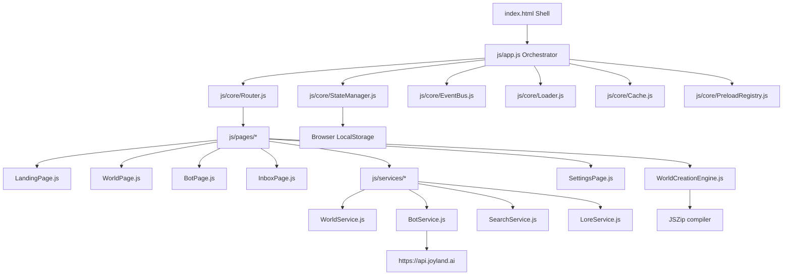
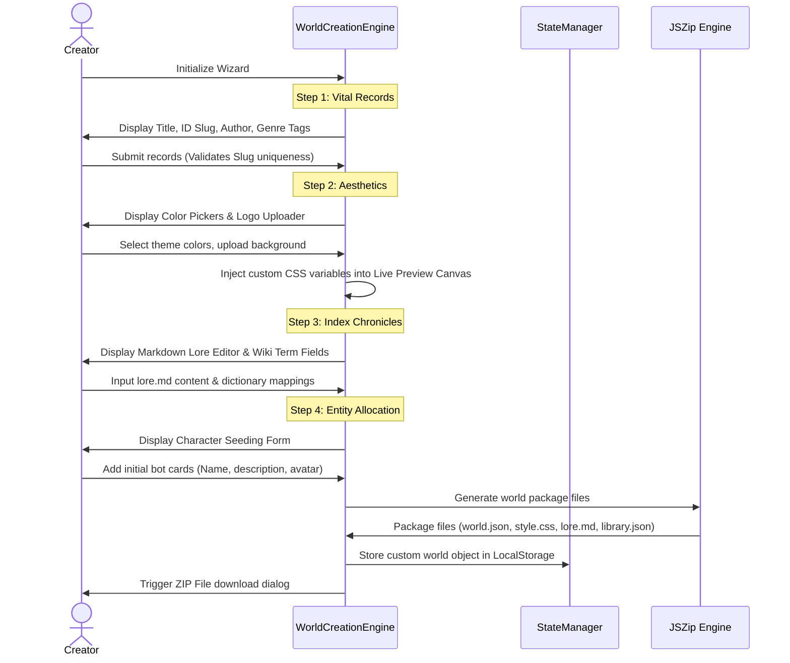

# SOFTWARE REQUIREMENTS SPECIFICATION (SRS)
## Project: World-Nexus (Real-Time World Building & Interactive Entity Explorer)
**Document Version:** 1.1.0  
**Date:** July 1, 2026  
**Author:** Antigravity AI  
**Status:** Approved / Base Specification  

---

## 1. INTRODUCTION

### 1.1 Purpose
This document specifies the software requirements for **World-Nexus**, an interactive web-based platform designed for building, sharing, and collaborating on fictional RPG worlds and intelligent character profiles (bots). The primary goal of World-Nexus is to provide a public, community-driven platform where creators can collaborate in real time, showcase their worlds, and share their creations with a global audience of roleplayers and writers.

### 1.2 Scope
World-Nexus is a collaborative world-building ecosystem and entity hub. It aggregates fictional universes, compiles custom themes on the fly, integrates with the Joyland AI bot API, and hosts a multi-step World Creation wizard. It supports client-side features such as comment systems, request queues (Inbox) for co-authoring, and responsive particle styling. The core system operates as a fully interactive Single Page Application (SPA).

### 1.3 Design Constraints & Target Environment (Roleplay Intro Tool Only)
The core World-Nexus web platform is a highly interactive application requiring JavaScript for routing, state synchronization, and wizard engines. 

However, a strict design constraint of **progressive enhancement** (HTML/CSS only) applies **exclusively to the Roleplay Intro Tool (Intro Editor)**. This tool generates greeting cards and character cards to be deployed on third-party roleplay hosts (e.g., Joyland greeting messages) where:
* Inline and external JavaScript is completely blocked or sanitized.
* Event handlers (`onclick`, `onload`, etc.) are stripped.
* DOM manipulation is unavailable.
* Layouts must remain visually complete and functional using **only HTML and CSS**.

---

## 2. SYSTEM ARCHITECTURE & DATA FLOW

The application utilizes an Event-Driven Single Page Application pattern. Client-side routing, modular page controllers, and reactive state management are built using vanilla ES modules without heavy external framework dependencies.

### 2.1 Component Block Diagram


### 2.2 Offline Layer (PWA)
A Service Worker (`sw.js`) intercepts HTTP requests to enable offline operational capability:
* **Precache Assets:** Initial load scripts (`app.js`, `Router.js`, etc.), main styles (`variables.css`, `base.css`), icons, and data config files.
* **Cache-First Strategy:** Applied to Google Fonts origins (`fonts.googleapis.com`, `fonts.gstatic.com`) and CDN scripts (Bootstrap Icons via `cdn.jsdelivr.net`).
* **Stale-While-Revalidate Strategy:** Applied to local page scripts, worlds configuration, and JSON datasets to enable background updating without blocking the user.

---

## 3. CORE INFRASTRUCTURE SPECIFICATION

### 3.1 Router Module (`js/core/Router.js`)
Handles client-side path parsing, popstate observation, and page transition triggers.
* **Navigation Hooks:** Listens to `popstate` and `hashchange` browser events.
* **Anchor Interception:** Intercepts general clicking of `<a>` tags. Excludes external links, mailto/tel protocols, downloads, and hash-anchors targeted to the active document.
* **Dynamic Resolvers:**
  * **Hash:** Resolves `#/world/<id>`, `#/bot/<id>`, `#/profile/<id>`, `#/settings/<tab>`, `#/feed`, `#/inbox`, and `#/tag/<tag>`.
  * **Query String:** Resolves search links containing `?world=...`, `?bot=...`, `?tag=...`.
  * **Static File Path Fallback:** Matches clean preloaded HTML files (e.g., `/arcanis.html` or `/bot-max-smasher.html`) to facilitate static hosting crawls (SEO indexability).
* **Auto-Resolving Link Helper:** Dynamic markdown links containing class `.auto-resolve-link` query `WorldService` asynchronously on click to classify the destination as a world or a bot page and routes accordingly.

### 3.2 State Manager Module (`js/core/StateManager.js`)
Manages client-side reactivity and storage serialization.
* **Global State Schema:**
  ```javascript
  this.state = {
    currentWorld: null,      // Active world object
    searchQuery: '',         // Core search keyword
    selectedGenres: [],      // Active category filter tags
    sortBy: 'featured',      // Sort order: featured, newest, alphabetical, popular
    theme: 'dark-theme',     // Global theme tag
    favorites: [],           // Favorited bot IDs
    currentUser: null,       // User profile session object (Guest if null)
    activeIdentity: null,    // User's active posting identity (username or bot ID)
    customCharacters: [],    // Locally created bot configurations
    customWorlds: [],        // Locally created world configurations
    comments: [],            // User/bot comment logs
    follows: [],             // User follow logs
    inboxRequests: [],       // Collaborative inbox approvals (collaboration requests, lore drafts)
    notifications: [],       // User notifications
    worldActivities: [],     // Simulated timeline activities
    worldCollaborators: {},  // Mapping of world IDs to collaborator access lists
    customLore: []           // Locally approved custom lore subpages
  };
  ```
* **Reactivity:** Emits event updates (`state:<key>`) via `EventBus` when state parameters change.
* **Persistence Lifecycle:** Automatically serializes modified fields (e.g., `favorites`, `customWorlds`, `comments`) to `localStorage` under keys prefixed with `world_nexus_`.
* **Quota Management:** Catches `QuotaExceededError` if browser storage exceeds limit, prompting warnings gracefully without crashing.

### 3.3 Event Bus Module (`js/core/EventBus.js`)
A publish-subscribe messaging hub enabling decoupled communication between UI components, core services, and page transition controllers.
* **Methods:**
  * `on(event, callback)`: Registers event listener callbacks.
  * `off(event, callback)`: Unsubscribes active event callbacks.
  * `emit(event, data)`: Synchronously dispatches payloads to active subscriptions.

---

## 4. SERVICE LAYER SPECIFICATION

### 4.1 World Service (`js/services/WorldService.js`)
Orchestrates world metadata retrieval.
* **Dynamic Scanning (Local Dev Mode):** If running on `localhost` or `127.0.0.1`, it parses the directory listing of `/Worlds/` using `DOMParser` to automatically compile a list of available worlds.
* **Registry Fallback:** If not running locally or scanning fails, it queries the static `Worlds/WorldList.json` array.
* **Concurrent Metadata Retrieval:** Resolves individual world definitions concurrently:
  * Pulls `world.json` files from world folders.
  * Dynamically parses themes (`style.css`) to extract primary and accent colors from CSS variables (`--primary-accent` and `--bg-hero-overlay`) to apply custom colors to the shell.
* **Preload Integration:** Intercepts load pipelines to pull pre-compiled worlds from `PreloadRegistry` first, optimizing initialization speeds.

### 4.2 Bot Service (`js/services/BotService.js`)
Orchestrates character profiles and API integration.
* **API Synchronization:** Interfaces with the Joyland API endpoint:
  `https://api.joyland.ai/profile/public-bots?userId=<userId>`
  * Triggers concurrent GET requests for configured creator IDs (e.g., `2xYazJ`, `lMjZp`, `rd2be`).
  * Injects custom request headers: `Origin`, `Referer`, and a client-side generated alphanumeric `Fingerprint`.
* **Dynamic Stats Extraction:** The following fields are extracted from the Joyland API response payloads:
  * `botId`: Handled as the remote bot identifier.
  * `characterName` or `name`: The display name of the bot.
  * `avatar`: Profile image resource URL.
  * `introduce` or `introduceText`: Character description/summary.
  * `botChats` or `chatCount`: Chat interaction total count.
  * `botLikes` or `likeCount`: Total recommendation likes count.
  * `tags`: Array of categories (including gender tags like "Male", "Female", "Non-binary").
  * `categoryName`: Sub-genre/category classification.
* **Dynamic Stats Merging:** Maps dynamic Joyland statistics back to local characters:
  * Extracts target bot IDs by parsing `chatEndpoint` with regex matching `/chat/([a-zA-Z0-9]+)`.
  * Merges the dynamic stats (`chats`, `likes`, `tags`) into the corresponding local character profile.
  * Combines tags cleanly: `bot.tags = Array.from(new Set([...localTags, ...joyTags]))`, and mirrors this to `bot.genres`.
  * Syncs local attributes back to the Joyland bot object (`id`, `worldId`, `worldTitle`, `worldAccent`, `worldAccentRgb`, `hasLocalData = true`, `lore`) to allow the platform to theme dynamically fetched remote characters correctly.
  * Emits `bots:synced` event to trigger dynamic UI updates.
* **Custom Character Composition:** Resolves and combines pre-compiled world characters, dynamic Joyland characters, and locally stored custom characters into a unified dataset.

### 4.3 Search Service (`js/services/SearchService.js`)
Features advanced structured prefix queries and background content indexing.
* **Search Query Parsing:** Translates text queries into categorized structural filters. Supports prefix tags and phrase values wrapped in quotes:
  * `tag:<genre>` or `tags:<genre>`
  * `character:<name>` or `characters:<name>`
  * `bot:<name>` or `bots:<name>`
  * `creator:<author>` or `creators:<author>`
  * `author:<author>` or `authors:<author>`
* **Query Parser Pattern:**
  ```javascript
  // Example query: 'tag:"dark fantasy" character:max'
  // Result:
  {
    tags: ["dark fantasy"],
    characters: ["max"],
    bots: [],
    creators: [],
    general: []
  }
  ```
* **Asynchronous Global Indexing:** Initialized on bootstrap. Iterates through all worlds and characters to pre-fetch text datasets in the background:
  * Downloads main world `lore.md` files.
  * Resolves `library.json` wikis and fetches subpage markdown documents.
  * Downloads character `lore.md` and `scenario.md` files.
  * Consolidates terms into `searchIndexContent` arrays mapped to the cache, enabling instantaneous multi-field client-side searches.

---

## 5. UI COMPONENTS & INTERACTION SPECIFICATION

### 5.1 Hover Preview Card (`js/ui/HoverPreview.js`)
Implements non-intrusive metadata preview windows.
* **Hover Interaction:** Observes elements containing `.hover-preview-trigger`. On hover, positions a floating dynamic overlay relative to the viewport.
* **Image Sequencing:** Displays a sequence of hover images (defined as `hoverImages` in `world.json`) transitioning through an animation loop.

### 5.2 Theme Loader Component (`js/ui/ThemeLoader.js`)
Adapts the application styling shell to the aesthetic rules of a specific world.
* **Injected Styling:** Injects an `<link>` stylesheet target referencing the world's `style.css`.
* **Cleanup Strategy:** Clears injected style links on page unloads, restoring the default World-Nexus theme variables.

### 5.3 Comment System (`js/ui/CommentSystem.js`)
Facilitates social interactions attached to worlds or character boards.
* **Posting Identity Switcher:** Users can post comment entries under their profile user handle, or masquerade as any bot belonging to the current world (if local files provide corresponding sprites).
* **Likes System:** Increments localized like counts. Persists changes back to the state log.
* **Mention System:** Parses comments for `@character-id` triggers. Wraps mentions in dynamic links with the class `mention-link` to enable navigation to that character profile.

### 5.4 Character Cards Component (`js/ui/BotCard.js`)
Renders fully interactive, responsive portrait-aspect card modules for character entities within worlds or search views.
* **Dynamic Variable Binding:** Card elements are populated using the following properties:
  * `bot.name` / `bot.title` (falls back to "Unknown Bot"): Populates the card header title.
  * `bot.cardImage` / `bot.avatar`: Binds to the background portrait layout utilizing `lazyLoader`.
  * `bot.chats` (falls back to `0`): Populates the chat interaction stat chip.
  * `bot.likes` (falls back to `0`): Populates the recommendation likes stat chip.
  * `bot.description` / `bot.introduce` (falls back to "No description available."): Populates the description snippet.
  * `bot.genres` / `bot.tags`: Rendered as clickable genre tags at the bottom.
  * `bot.chatEndpoint`: Binds to the "Start Chat" CTA button (triggered on card hover).
* **Dynamic World Theme Injection:** The card layout container dynamically injects the parent world's style specifications:
  * Maps `bot.worldAccent` to `--accent` CSS variable.
  * Maps `bot.worldAccentRgb` to `--accent-rgb` CSS variable.
  * Binds variables to styling declarations to automatically adjust glows, border accents, and card button hover states to match the character's parent world theme.
* **Special Type Handling:** Detects if a card is "Joyland Only" (`!bot.worldId` and references a `joyland.ai` endpoint). Clicking the card automatically triggers direct external redirection instead of loading internal bot details subpages.

---

## 6. FUNCTIONAL WORKFLOWS & WIZARDS

### 6.1 World Creation Engine (`js/pages/WorldCreationEngine.js`)
A 4-step wizard interface designed to configure, preview, compile, and download world resource packages.



* **Step 1: Vital Records:** Captures world name, author, categories, and folder slug ID (slug validates against folder characters to avoid naming conflicts).
* **Step 2: Aesthetics:** Captures cover images, logos, typography, and theme color variables. The layout compiles color selections on the fly into an inline preview canvas displaying an interactive world card.
* **Step 3: Index Chronicles:** A split-screen Markdown editor with live HTML preview rendering lore text, and form inputs to map dictionary definitions (`library.json`).
* **Step 4: Entity Allocation:** Allows creation of local character profiles.
* **Export Package Compilation:** Generates:
  * `world.json`: World metadata configurations.
  * `style.css`: Theme variable stylesheets.
  * `lore.md`: Core history files.
  * `library.json`: Dict map.
  * Bundles files using JSZip to trigger a download of the compiled archive.

### 6.2 Collaborative Inbox Workflow (`js/pages/InboxPage.js`)
Facilitates mock git-style community collaboration management for administrators.
* **Actionable Proposals:**
  * **Collaboration invites:** Grants external users editor rights, updating the `worldCollaborators` state mappings.
  * **Lore proposals:** Displays side-by-side split screens comparing proposed lore markdown adjustments. Clicking accept compiles the custom lore article and appends it to `customLore` state records.
  * **Character proposals:** Displays proposed character profiles. Clicking accept creates a new character record, appending it to the `customCharacters` registry.
* **Activity Alerts:** Passive notification log tracking followers, comment activity, and edits.

---

## 7. EXTERNAL & AUXILIARY TOOLS (NON-CORE COMPONENTS)

These are auxiliary, external tools that do not form a major part of the core World-Nexus collaborative platform, serving as separate utilities for creators.

### 7.1 Roleplay Intro Tool / Intro Editor (`tools/intro-editor/ie.html`)
An external visual card layout builder that generates clean HTML/CSS components for third-party platforms (like Joyland greeting messages).
* **No-JS Compatibility:** Generates layouts that function without script execution, adhering to strict progressive enhancement rules for external environments.
* **Features:**
  * Preset theme select inputs (Cyberpunk, Steampunk, Outrun, Solarpunk).
  * Variable color swatches mapping directly to output styling selectors.
  * Clean, inline markup and compressed stylesheet builder.

### 7.2 Music Player (`tools/music-player/mw.html`)
An external tactical theme widget featuring video/audio synchronization.
* **Hidden Media Frame:** Controls playback of streaming clips via a hidden `<iframe>` acting as the audio player engine.
* **Layout Design:** Styled after sci-fi control panels (Nasapunk aesthetics), incorporating background grids, visualizers, track list selection drawers, and progress bars.

---

## 8. NON-FUNCTIONAL REQUIREMENTS

### 8.1 Performance & Resource SLAs
* **FOIT Prevention:** Preloads critical typography subsets (`Cinzel`, `Outfit`, `Orbitron`, `Rajdhani`) alongside display swap declarations.
* **Non-Blocking Assets:** Scripts and stylesheets for third-party libraries (e.g., JSZip, Bootstrap Icons) must load asynchronously using defer attributes or print media tricks.
* **Lazy Loading:** Main scroll lists (grids) must defer rendering and asset loading for below-the-fold content using the `IntersectionObserver` wrapper (`LazyLoader.js`).

### 8.2 Security & Purification
* **HTML Sanitization:** To counter injection vulnerability in markdown lore parsers, `LoreService.purifyHtml()` must strip standard script elements, script tags, event variables, and javascript/data URI protocol strings from input markdown before passing content to `marked.js`.
* **Link Target Hardening:** All external hyperlinks must declare `target="_blank" rel="noopener noreferrer"`.

---

## 9. APPENDIX: METADATA & DATA SCHEMAS

### 9.1 World Schema (`world.json`)
```json
{
  "$schema": "http://json-schema.org/draft-07/schema#",
  "type": "object",
  "properties": {
    "id": { "type": "string" },
    "title": { "type": "string" },
    "author": { "type": "string" },
    "colaborators": {
      "type": "array",
      "items": { "type": "string" }
    },
    "description": { "type": "string" },
    "genres": {
      "type": "array",
      "items": { "type": "string" }
    },
    "coverImage": { "type": "string" },
    "logo": { "type": "string" },
    "theme": { "type": "string" },
    "lore": { "type": "string" },
    "botCount": { "type": "integer" },
    "hoverPreview": { "type": "boolean" },
    "hoverImages": {
      "type": "array",
      "items": { "type": "string" }
    },
    "featuredBots": {
      "type": "array",
      "items": { "type": "string" }
    }
  },
  "required": ["id", "title", "description"]
}
```

### 9.2 Wiki Term Library Schema (`library.json`)
```json
{
  "$schema": "http://json-schema.org/draft-07/schema#",
  "type": "object",
  "additionalProperties": {
    "type": "object",
    "properties": {
      "definition": { "type": "string" },
      "subpage": { "type": "string" }
    },
    "required": ["definition"]
  }
}
```

### 9.3 Character / Bot Schema (`<character-id>.json`)
```json
{
  "$schema": "http://json-schema.org/draft-07/schema#",
  "type": "object",
  "properties": {
    "id": { "type": "string" },
    "name": { "type": "string" },
    "world": { "type": "string" },
    "description": { "type": "string" },
    "genres": {
      "type": "array",
      "items": { "type": "string" }
    },
    "cardImage": { "type": "string" },
    "avatar": { "type": "string" },
    "sprite": { "type": "string" },
    "lore": { "type": "string" },
    "scenario": { "type": "string" },
    "chatEndpoint": { "type": "string" },
    "status": { "type": "string" },
    "featured": { "type": "boolean" },
    "metadata": {
      "type": "object",
      "properties": {
        "character": { "type": "string" },
        "timeline": { "type": "string" }
      }
    }
  },
  "required": ["id", "name", "world", "description"]
}
```
